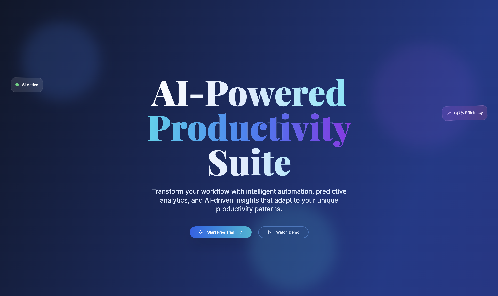

# AI-Powered Productivity Suite

A clean, gradient-heavy landing page showcasing an advanced AI workspace tool designed for modern professionals. The platform combines cutting-edge artificial intelligence with intuitive productivity features, presented through sophisticated design and interactive demonstrations.

## Features

- Clean, gradient-heavy design with sophisticated color palette
- Interactive AI workspace demo sections
- Before/after productivity comparison widgets
- Floating UI elements with glassmorphism effects
- Modern office space imagery and abstract tech visuals
- Real-time productivity metrics and analytics
- AI feature showcase with interactive demonstrations
- Responsive design optimized for business professionals

## Design Preview



The landing page showcases:
- Hero section with gradient backgrounds and floating AI interface elements
- Interactive demo sections showing AI capabilities in real-time
- Before/after productivity comparisons with animated statistics
- Modern office environments with professional team imagery
- Sophisticated glassmorphism effects and clean typography
- AI-powered feature demonstrations with smooth animations

## Key Sections

- **Hero**: "Supercharge Your Productivity with AI" with floating interface elements
- **AI Demo**: Interactive showcase of AI writing, scheduling, and task management
- **Productivity Comparison**: Before/after metrics showing efficiency improvements
- **Features**: AI writing assistant, smart scheduling, automated workflows
- **Workspace Preview**: Clean dashboard mockups with AI-powered insights
- **Testimonials**: Business professionals and productivity experts
- **Pricing**: Tiered plans for individuals, teams, and enterprises

## Color Palette

- **Deep Navy**: Primary Dark (#0F172A)
- **Slate Blue**: Secondary Blue (#334155)
- **Bright Cyan**: Accent Blue (#06B6D4)
- **Electric Purple**: Accent Purple (#8B5CF6)
- **Emerald Green**: Success Green (#10B981)
- **Amber Orange**: Warning Orange (#F59E0B)
- **Cool Gray**: Neutral Gray (#64748B)
- **Pure White**: Background White (#FFFFFF)
- **Glass White**: Semi-transparent (#FFFFFF20)

## Key Components

### Interactive AI Demo
- Live AI writing assistant demonstration
- Smart calendar scheduling with AI suggestions
- Automated task prioritization showcase
- Real-time productivity analytics
- Voice-to-text and AI transcription features

### Productivity Comparison
- Animated before/after statistics
- Time-saving calculations and metrics
- Efficiency improvement visualizations
- ROI calculator for productivity gains
- Team collaboration improvements

### Floating UI Elements
- Glassmorphism cards with backdrop blur
- Floating dashboard widgets
- Animated AI interface components
- Smooth parallax scrolling effects
- Interactive hover states with glass effects

### Gradient Backgrounds
- Sophisticated blue gradient overlays
- Smooth color transitions
- Subtle animation effects
- Professional business aesthetics
- Modern tech-inspired visuals

## Tech Stack

- Next.js 14 with TypeScript
- Tailwind CSS with custom gradient utilities
- Shadcn/ui components with glassmorphism variants
- Framer Motion for smooth animations
- Recharts for productivity analytics
- React Query for demo data management
- Adobe Stock for modern office and tech imagery

## Interactive Features

### AI Writing Assistant Demo
- Real-time text generation
- Grammar and style suggestions
- Tone adjustment capabilities
- Content optimization recommendations
- Multi-language support demonstration

### Smart Scheduling
- AI-powered calendar optimization
- Meeting conflict resolution
- Intelligent time blocking
- Productivity pattern analysis
- Automated scheduling suggestions

### Productivity Analytics
- Real-time performance metrics
- Time tracking and analysis
- Goal progress visualization
- Team collaboration insights
- Efficiency trend reporting

## Getting Started

```bash
npm install
npm run dev
```

Open [http://localhost:3000](http://localhost:3000) to view the landing page.

## Adobe Stock Asset Requirements

### Hero Section
- **Modern Office Spaces**: Clean, minimalist workspaces with natural lighting
- **Abstract Tech Imagery**: AI and machine learning visual representations
- **Professional Team Photos**: Diverse professionals using technology

### Demo Sections
- **AI Interface Mockups**: Clean dashboard and workspace screenshots
- **Productivity Visualizations**: Charts, graphs, and data analytics imagery
- **Technology Concepts**: Abstract representations of AI and automation

### Background Elements
- **Gradient Textures**: Sophisticated blue and purple gradient backgrounds
- **Glass Effects**: Transparent and frosted glass textures
- **Tech Patterns**: Subtle geometric and circuit-inspired designs
- **Office Environments**: Modern, professional workspace photography

## Glassmorphism Effects

### Implementation
```css
.glass-card {
  background: rgba(255, 255, 255, 0.1);
  backdrop-filter: blur(20px);
  border: 1px solid rgba(255, 255, 255, 0.2);
  border-radius: 16px;
  box-shadow: 0 8px 32px rgba(0, 0, 0, 0.1);
}

.glass-gradient {
  background: linear-gradient(135deg, 
    rgba(255, 255, 255, 0.1) 0%,
    rgba(255, 255, 255, 0.05) 100%);
}
```

### Design Elements
- Semi-transparent cards with backdrop blur
- Subtle border highlights
- Soft drop shadows
- Smooth transitions and hover effects
- Professional, modern aesthetic

## Animation Features

- Smooth gradient transitions
- Floating element animations
- Interactive demo state changes
- Parallax scrolling effects
- Glassmorphism hover interactions
- Progressive loading animations
- Smooth scroll-triggered animations

## Productivity Metrics

### Before/After Comparisons
- **Time Saved**: 40% reduction in administrative tasks
- **Efficiency Gain**: 60% improvement in task completion
- **Focus Time**: 3x increase in deep work sessions
- **Collaboration**: 50% faster team communication
- **Decision Making**: 2x faster with AI insights

### Interactive Calculators
- ROI calculator for productivity improvements
- Time-saving estimator based on team size
- Efficiency benchmark comparisons
- Cost-benefit analysis tools

## Typography

- **Headings**: Modern geometric font (Inter or Poppins)
- **Body**: Clean sans-serif (System UI or Roboto)
- **Code/Data**: Monospace for technical elements (JetBrains Mono)
- **Accent**: Elegant display font for hero elements

## Responsive Design

- **Mobile**: Stacked layouts with touch-friendly interactions
- **Tablet**: Adaptive grid system with optimized demos
- **Desktop**: Full-width gradients with floating elements
- **Large Screen**: Immersive glassmorphism effects

## Accessibility

- High contrast mode support
- Keyboard navigation for all interactive elements
- Screen reader compatibility
- Focus indicators with glassmorphism styling
- Alt text for all AI and productivity imagery

## Performance Optimization

- Lazy loading for demo sections
- Optimized gradient rendering
- Efficient glassmorphism implementations
- Progressive image loading
- Smooth 60fps animations

## SEO & Analytics

- Meta tags focused on AI productivity keywords
- Schema markup for SaaS products
- Productivity tool structured data
- Business software optimization
- AI technology relevant keywords

## License

MIT License
